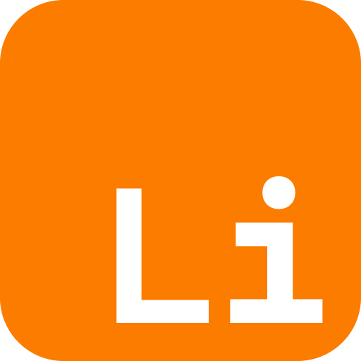

<a name="readme-top"></a>

[![Contributors][contributors-shield]][contributors-url]
[![Forks][forks-shield]][forks-url]
[![Stargazers][stars-shield]][stars-url]
[![Issues][issues-shield]][issues-url]

<!-- PROJECT LOGO -->
<br />
<div align="center">
  <a href="https://github.com/lithium_apps/edge">
    
  </a>

  <h3 align="center">@lithium/edge</h3>

  <p align="center">
    A NestJS module to use Edge.JS templating language.
    <br />
    <br />
    <a href="https://github.com/lithium-apps/edge/issues/new?labels=enhancement">Request Feature</a>
    ·
    <a href="https://github.com/lithium-apps/edge/issues/new?labels=bug">Report Bug</a>
    ·
    <a href="https://github.com/lithium-apps/edge/issues/new?labels=enhancement">Request Modification</a>
  </p>
</div>

<!-- TABLE OF CONTENTS -->
<details>
  <summary>Table of Contents</summary>
  <ol>
    <li>
      <a href="#about-the-project">About The Project</a>
      <ul>
        <li><a href="#built-with">Built With</a></li>
      </ul>
    </li>
    <li>
      <a href="#install-the-package">Install the package</a>
    </li>
    <li>
      <a href="#use-the-package">Use the package</a>
    </li>
    <li>
      <a href="#utils-links">Utils links</a>
    </li>
    <li><a href="#contact">Contact</a></li>
  </ol>
</details>

<!-- ABOUT THE PROJECT -->

## About the project

The Edge module is based on the idea of using Edge.JS templating within a Nest application. The main problem with using Edge.JS within Nest comes from the resolution of Edge in ESM. In this case, we're using a workaround to make use of the dynamic import.

This module is built dynamically, allowing you to define a customized configuration for each use case. We recommend that you create a dedicated custom configuration file by importing a configuration object such as `edge.config.ts`.

We welcome contributions and improvements to this module. Don't hesitate to submit features and improvements ;)

<p align="right">(<a href="#readme-top">back to top</a>)</p>

### Built With

-   [![TypeScript][TypeScript]][TypeScript-url]
-   [![NestJS][NestJS]][NestJS-url]
-   [![EdgeJS][EdgeJS]][EdgeJS-url]

<p align="right">(<a href="#readme-top">back to top</a>)</p>

<!-- INSTALL PACKAGE -->

## Install the package

For now the package isn't published to npm, but you can install it from the GitHub registry and can be installed in any project.

1.  You need to create a `.npmrc` file at the root of your project with the following content:

    ```sh
    @lithium-apps:registry=https://npm.pkg.github.com
    ```

2.  For the login process you need to set a personal access token with the `read:packages` scope.
    Then you can login to the GitHub registry with the following command:
    ```sh
    pnpm login --registry=https://npm.pkg.github.com --scope=@lithium-apps
    ```

   3. You can now install the packages using the following command:
       ```sh
       pnpm install @lithium-apps/edge
       ```

<p align="right">(<a href="#readme-top">back to top</a>)</p>


<!-- USE PACKAGE -->

## Use the package

1.  Create a configuration file for Edge.JS :

    ```typescript
    import { EdgeConfig } from '@lithium-apps/edge';

    export const edgeConfig: EdgeConfig = {
        mount: {
            // Define all the named disk mount points
            views: join(__dirname, 'path_to_views'),
        },
    
        // You can set plugins here
        plugins: [],
    
        // You can set globals here
        globals: {},
    
        // Check other options in the EdgeConfig interface
    };
    ```

2.  Import the `EdgeModule` in your application module:

    ```typescript
    import { Module } from '@nestjs/common';
    import { EdgeModule } from '@lithium-apps/edge';
    
    import { edgeConfig } from './edge.config';
    import { MyController } from './my.controller';

    @Module({
        imports: [
            EdgeModule.forFeature(edgeConfig)
        ],
    
        controllers: [MyController]
    })
    export class MyModule {}
    ```

3. Use the `@Render()` decorator in your controller:

    ```typescript
    import { Controller, Get } from '@nestjs/common';
    import { EdgeService } from '@lithium-apps/edge';

    @Controller()
    export class MyController {
   
        @Get('/')
        @Render('views::welcome') // Specify the view to render
        async getHello() {
            return { name: 'Kylian' }; // Data to pass to the view
        }
    }
    ```

<!-- UTILS LINKS -->

## Utils links

Here are a few useful links to help you use the module or learn more about it! Don't thank us, you'll sleep better :)

-   [Edge.JS documentation](https://edgejs.dev/docs/introduction): The official documentation of the Edge.JS templating language.
-   [NestJS documentation](https://docs.nestjs.com/): The official documentation of the NestJS framework.

<!-- CONTACT -->

## Contact

-   Kylian Mallet - [@Kylian-Mallet](https://github.com/Kylian-Mallet) - [kylian.mallet@sklav.group](mailto:kylian.mallet@sklav.group)

<p align="right">(<a href="#readme-top">back to top</a>)</p>

<!-- MARKDOWN LINKS & IMAGES -->
<!-- https://www.markdownguide.org/basic-syntax/#reference-style-links -->

[contributors-shield]: https://img.shields.io/github/contributors/lithium-apps/edge.svg?style=for-the-badge
[contributors-url]: https://github.com/lithium-apps/edge/graphs/contributors
[forks-shield]: https://img.shields.io/github/forks/lithium-apps/edge.svg?style=for-the-badge
[forks-url]: https://github.com/lithium-apps/edge/network/members
[stars-shield]: https://img.shields.io/github/stars/lithium-apps/edge.svg?style=for-the-badge
[stars-url]: https://github.com/lithium-apps/edge/stargazers
[issues-shield]: https://img.shields.io/github/issues/lithium-apps/edge.svg?style=for-the-badge
[issues-url]: https://github.com/lithium-apps/edge/issues
[license-shield]: https://img.shields.io/github/license/lithium-apps/edge.svg?style=for-the-badge
[license-url]: https://github.com/lithium-apps/edge/blob/master/LICENSE.txt

[NestJS]: https://img.shields.io/badge/NestJS-E0234E?logo=nestjs&logoColor=fff&style=for-the-badge
[NestJS-url]: https://nestjs.com/
[TypeScript]: https://img.shields.io/badge/typescript-3178C6?style=for-the-badge&logo=typescript&logoColor=white
[TypeScript-url]: https://www.typescriptlang.org/
[EdgeJS]: .github/assets/edgejs_badge.svg
[EdgeJS-url]: https://edgejs.dev/docs/introduction